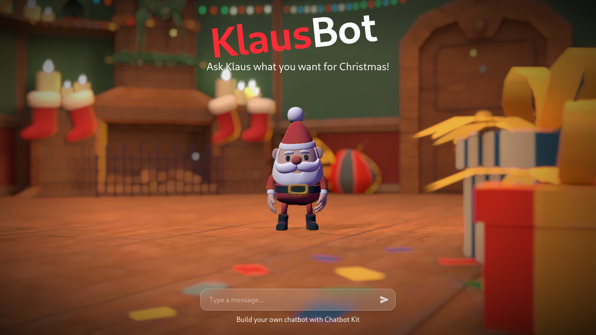
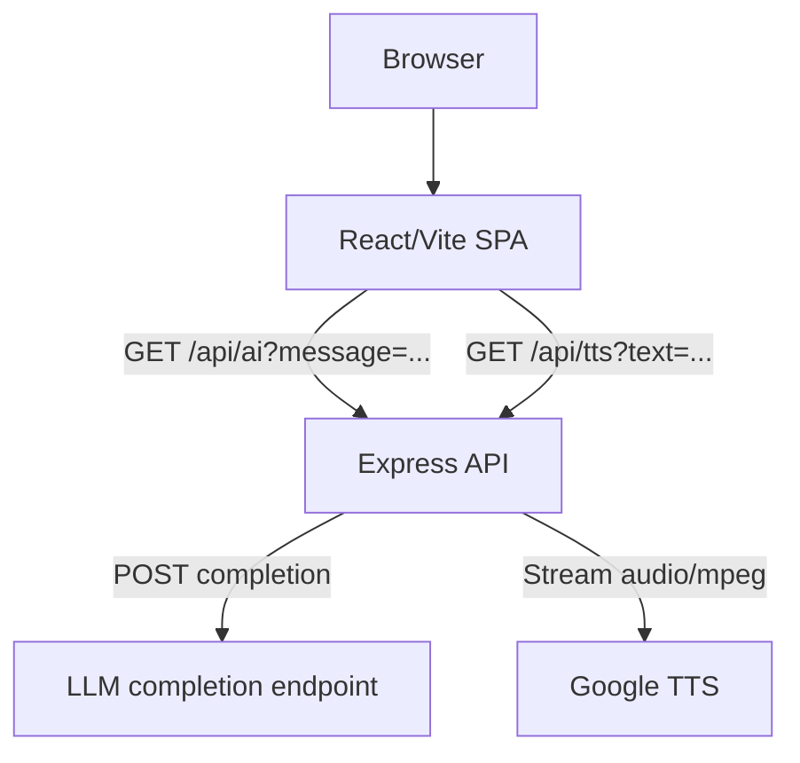

<h1>
  
  Klaus
</h1>


> Klaus is a Vite + React SPA paired with an Express API. The UI combines a 3D character scene, chat interface, and audio playback, while the API provides chat completions and TTS audio streaming



# **Overview**

Klaus is a TypeScript web app with a Vite + React frontend and an Express API backend. The frontend renders a 3D scene with a chat UI and audio-driven lip sync. The backend exposes two HTTP endpoints: chat completions and TTS audio streaming.

# **Key Features**

- 3D character scene with postprocessing and particle VFX
- Chat UI with message history and status-driven states
- LLM completion proxy endpoint with in-memory conversation history
- TTS proxy endpoint that streams `audio/mpeg`
- Client-side audio playback with lip sync driven by viseme detection

# **Tech Stack**

## **Frontend**

- React 19 + Vite
- TypeScript
- Tailwind CSS (via `@tailwindcss/vite`)
- `three`, `@react-three/fiber`, `@react-three/drei`, `@react-three/postprocessing`
- `wawa-vfx`, `wawa-lipsync`
- `motion` for UI animation
- Zustand for client state

## **Backend**

- Node.js + Express 5
- TypeScript
- `axios` for HTTP
- `cors` and `dotenv`
- `google-tts-api` for TTS URL generation

## **Build Tools**

- Vite (frontend)
- TypeScript compiler (`tsc`)
- `tsx` for server development
- npm (package-lock files present)

## **Developer Tooling**

- ESLint (client)
- Prettier (client and server)
- TypeScript strict mode

# **Architecture Overview**

The repository is split into a `client` Vite SPA and a `server` Express API. The browser client calls the API for chat responses and TTS audio. The API forwards chat prompts to a completion endpoint configured via environment variables and proxies Google TTS audio as a stream.



# **Directory Structure**

- `client/` — Vite + React frontend
- `client/src/components/` — 3D scene, camera controls, UI
- `client/src/hooks/` — Zustand chatbot state and audio/lipsync logic
- `client/src/assets/` — models, textures, audio
- `client/src/utils/` — helper utilities
- `server/` — Express API server
- `server/src/` — server bootstrap and configuration
- `server/src/routes/` — HTTP routes for AI and TTS
- `server/src/controller/` — AI and TTS controller logic

# **Data Flow**

## **Request Lifecycle**

UI input → `sendMessage` → `GET /api/ai?message=...` → completion response → `GET /api/tts?text=...` → audio stream → WebAudio playback → lip sync and UI update

## **Persistence**

The server keeps a small in-memory chat history (up to 6 entries) per process.

## **API Communication**

HTTP endpoints use query parameters. `/api/ai` returns JSON; `/api/tts` returns `audio/mpeg` streaming responses.

# **API Surface**

- `GET /api/ai?message=...` → `{ response: string }`
- `GET /api/tts?text=...` → `audio/mpeg` stream

# **Getting Started**

## **Prerequisites**

- Node.js
- npm

## **Installation**

```bash
cd server
npm install
```

```bash
cd client
npm install
```

## **Development**

```bash
cd server
npm run dev
```

```bash
cd client
npm run dev
```

## **Build**

```bash
cd server
npm run build
```

```bash
cd client
npm run build
```

## **Lint / Format**

```bash
cd client
npm run lint
```

Prettier config exists in `client/.prettierrc` and `server/.prettierrc`.

# **Environment & Configuration**

The project uses `.env.local` files in both `client/` and `server/`.

Client (`client/.env.local`) variables:

- `VITE_CHAT_API_URL` — chat endpoint base URL
- `VITE_TTS_API_URL` — TTS endpoint base URL

Server (`server/.env.local` and `server/src/env.d.ts`) variables:

- `LLAMA_API_URL` — completion endpoint URL
- `LLAMA_API_KEY` — API key for the completion endpoint
- `CLIENT_URL` — CORS origin for the client
- `PORT` — server port (default 8000 if not set)
- `NODE_ENV` — `development` or `production`

# **Notable Implementation Details**

- The AI controller builds a prompt with a short, fixed chat history and sanitizes replies to remove stage directions and non-ASCII characters.
- The TTS controller streams Google TTS audio directly to the client instead of redirecting.
- The client routes audio through WebAudio into a `MediaStream` to avoid double playback and drive viseme-based lip sync.
- 3D rendering uses `react-three-fiber` with postprocessing and custom VFX emitters.

# **License**

This project is licensed under the **MIT License**. See the [](./LICENSE) for details.
